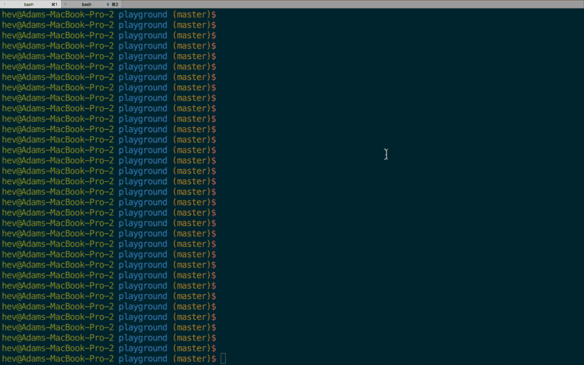

Log Cache CLI
=============

[![GoDoc][go-doc-badge]][go-doc] [![travis][travis-badge]][travis] [![slack.cloudfoundry.org][slack-badge]][loggregator-slack]

The Log Cache CLI can be installed and used in two ways.

 - Standalone CLI for Log Cache
 - Cloud Foundry CLI plugin for Log Cache

## Cloud Foundry CLI plugin

The Log Cache CLI Plugin is a [CF CLI](cf-cli) plugin for the [Log
Cache](log-cache) system.



### Installing Plugin

```
go get code.cloudfoundry.org/log-cache-cli
cf install-plugin $GOPATH/bin/log-cache-cli
```

### Usage

```
$ cf tail --help
NAME:
   tail - Output logs for a source-id/app

USAGE:
   tail [options] <source-id/app>

ENVIRONMENT VARIABLES:
   LOG_CACHE_ADDR       Overrides the default location of log-cache.
   LOG_CACHE_SKIP_AUTH  Set to 'true' to disable CF authentication.

OPTIONS:
   --follow, -f                 Output appended to stdout as logs are egressed.
   --gauge-name                 Gauge name filter (implies --envelope-type=gauge).
   --json                       Output envelopes in JSON format.
   --lines, -n                  Number of envelopes to return. Default is 10.
   --start-time                 Start of query range in UNIX nanoseconds.
   --counter-name               Counter name filter (implies --envelope-type=counter).
   --end-time                   End of query range in UNIX nanoseconds.
   --envelope-type, -type       Envelope type filter. Available filters: 'log', 'counter', 'gauge', 'timer', and 'event'.
```

```
$ cf log-meta --help
NAME:
   log-meta - Show all available meta information

USAGE:
   log-meta [options]

ENVIRONMENT VARIABLES:
   LOG_CACHE_ADDR       Overrides the default location of log-cache.
   LOG_CACHE_SKIP_AUTH  Set to 'true' to disable CF authentication.

OPTIONS:
   --guid              Display raw source GUIDs
   --noise             Fetch and display the rate of envelopes per minute for the last minute. WARNING: This is slow...
   --sort-by           Sort by specified column. Available: 'source-id', 'source', 'source-type', 'count', 'expired', 'cache-duration', and 'rate'.
   --source-type       Source type of information to show. Available: 'all', 'application', and 'platform'.
```


## Stand alone CLI

### Installing CLI

Run our install script:

```
curl -sS https://raw.githubusercontent.com/cloudfoundry/log-cache-cli/develop/scripts/install.sh | bash
```

### Usage

1. Target the Log Cache by setting the environment variable `LOG_CACHE_ADDR`.
1. Simply run the `log-cache` command to view current metrics stored in Log
   Cache.
1. Help can be accessed with the `--help` flag at any command level.

```
$ log-cache tail --help
Output logs and metrics for a given source-id

Usage:
  log-cache tail <source-id> [flags]

Flags:
  -f, --follow   Output appended to stdout as logs are egressed.
  -h, --help     help for tail
```

[log-cache]: https://code.cloudfoundry.org/log-cache-release
[cf-cli]: https://code.cloudfoundry.org/cli

[slack-badge]:              https://slack.cloudfoundry.org/badge.svg
[loggregator-slack]:        https://cloudfoundry.slack.com/archives/loggregator
[go-doc-badge]:             https://godoc.org/code.cloudfoundry.org/log-cache-cli?status.svg
[go-doc]:                   https://godoc.org/code.cloudfoundry.org/log-cache-cli
[travis-badge]:             https://travis-ci.org/cloudfoundry/log-cache-cli.svg?branch=master
[travis]:                   https://travis-ci.org/cloudfoundry/log-cache-cli?branch=master
